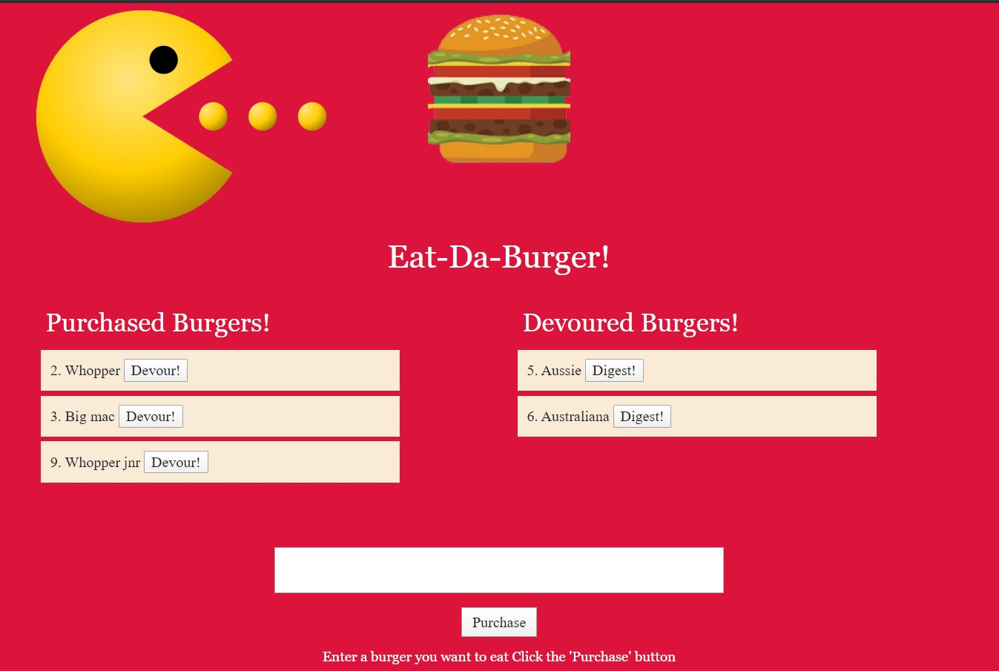

# burgerLog

Summary

The web application is a burgerLogger application that enables the user to create a list of saved
burgers each with an:
- id
- title
- button
The application uses validation to make sure the text box is not empty, if the user trys to create
a burger with no value, the user will be alerted and await the user to enter a value. The created
burgers are sent to the database where they are stored and then rendered back to the html page where
the data is displayed according to the requests made. the following object relational mapping (orm)
functions are used in this application.
- Create a burger
- Update the state of a burger
- Delete a burger
The application uses a server to retrieve and send data across various files which are then used
the process the data in order to display the created burgers to the user. On the user interface side
there was an additional feature added to the application which was a delete/ digest button added after
the burger is devoured in order to delete the selected burger from the database. Express handlebars was
used in creating the html page. The package allowed requested data to be rendered into the body of the
html page instead of creating strings and pushing them into an html file.

The following npm's and methods where used in the development of this application:
- fs
- express
- path
- jquery
- util
- .gitignore
- get
- post
- put
- delete
- ajax

Getting Started

This documentation will assist you in viewing this project. To view the project either open
the url of the deployed application with the following address in any browser:

https://hidden-lowlands-55614.herokuapp.com/

Download and clone the repository from GitHub using the following command:

git clone https://github.com/pozengineer/burgerLog.git

This application was built using:
- HTML: HyperText Markup Language that allows the developer to describe pages
- CSS: Style Sheet Language that allows the developer to style an HTML document
- BootStrap: Library of HTML and CSS files and code https://getbootstrap.com/
- API: Application Programming Interface, which is a software intermediary that
  allows two applications to talk to each other.
- Node.js: An open-source, cross-platform, JavaScript runtime environment that
  executes JavaScript code outside of a browser.
- Express.js: An open source web application framework for Node.js
- Heroku: Is a platform as a service (PaaS) that enables developers to build, run,
  and operate applications in the cloud
- HandleBars: Logicless templating language that keep the view and controller separate
- mySql: An open-source relational database management system

